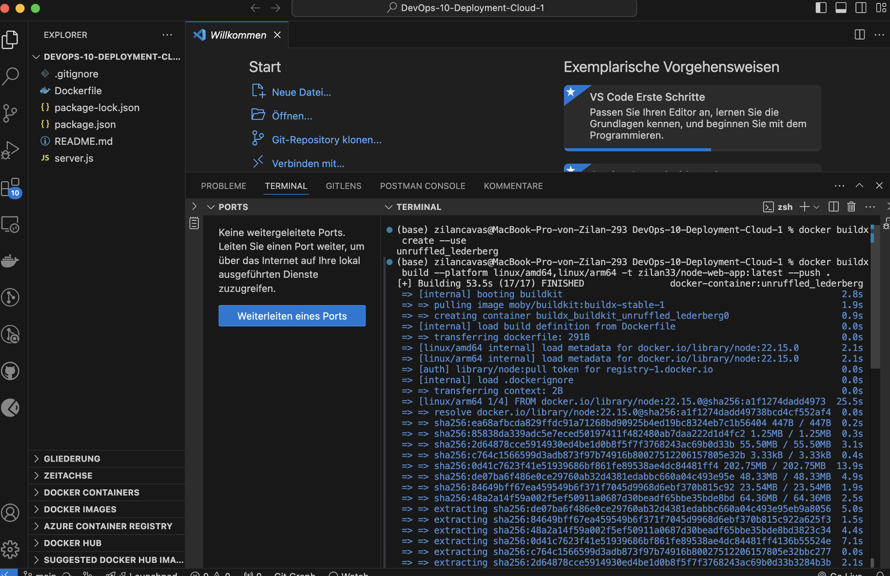

# DevOps 10 Deployment Cloud

## URL

| App-Name | Repo URL | Docker Hub URL |
| -------- | ------- | ------- |
| devopswebappzilan | https://github.com/zilancavas/DevOps-10-Deployment-Cloud | https://hub.docker.com/repository/docker/zilan33/node-web-app/general
 |

## Lernjournal
| Schritt | Beschreibung | Screenshot |
|---------|--------------|------------|
| 1 | Ich habe mich bei Azure über das Terminal angemeldet, um Zugriff auf die Azure-Ressourcen zu erhalten. Dafür habe ich den Befehl `az login` ausgeführt. Daraufhin öffnete sich ein Browserfenster, in dem ich mich mit meinen Azure-Zugangsdaten anmelden musste. |  |
| 2 | Im nächsten Schritt habe ich in Azure eine neue Ressourcengruppe erstellt, um alle relevanten Ressourcen zentral zu verwalten. Der Befehl `az group create --name DevOpsRGZilan --location westeurope` legt diese Ressourcengruppe in der Region West Europe an. |  |
| 3 | Anschliessend wurde ein App Service Plan in Azure erstellt, um die Ressourcen für die Web-App bereitzustellen. |  |
| 4 | Danach wurde die Web-App in Azure erstellt. Das legt die Web-App mit dem Container-Image aus Docker Hub an. |  |
| 5 | Nach der Erstellung der Web-App war diese zunächst gestoppt und gab den Fehler 403 zurück. |  |
| 6 | Das Azure Portal zeigte den Status „Kontingent überschritten“ an. Dies bedeutet, dass das kostenlose Kontingent der Azure-Studentenlizenz erreicht wurde. Deswegen musste ich 13 Stunden warten, um weitermachen zu können. |  |
| 7 | Am nächsten Tag wurde Das Docker-Image lokal gebaut und erfolgreich in das Docker Hub Repository gepusht. Dies ist notwendig, um das Image später in Azure zu verwenden. |  |
| 8 | Nach erfolgreicher Azure-Web-App Bereitstellung wurde die Anwendung im Browser aufgerufen. Die Seite zeigt eine einfache Testmeldung an, was bestätigt, dass die App läuft. |  |
| 9 | Die Anwendung wurde auch lokal mit getestet, um sicherzustellen, dass sie einwandfrei läuft und alle Container korrekt gestartet werden. |  |
| 10 | Das erstellte Docker-Image wurde in das Docker Hub Repository `zilan33/node-web-app` gepusht, um es für die Bereitstellung in der Cloud verfügbar zu machen. |  |
| 11 | Ich habe überprüft, ob das Docker-Image erfolgreich in meinem Docker Hub Repository `zilan33/node-web-app` vorhanden ist.  |  |
| 12 | Ich habe den GitHub Actions Workflow im Ordner `.github/workflows` erstellt, um die automatische Deployment-Pipeline für die Anwendung einzurichten. |  |
| 13 | Ich habe den GitHub Actions Workflow für das Deployment konfiguriert. |  |
| 14 | Ich habe im GitHub-Repository unter "Settings" → "Secrets and variables" → "Actions" die nötigen Secrets für die automatische Authentifizierung hinterlegt. Diese sind für die Docker- und Azure-Anmeldedaten notwendig, damit der Workflow automatisch läuft. |  |
| 15 | Ich habe die drei nötigen Secrets im GitHub Repository hinzugefügt. |  |
| 16 | Die Startseite wurde so geändert, dass sie eine Nachricht mit „Automatisierter Test von GitHub Actions – läuft alles?“ anzeigt. |  |
| 17 | Ich habe die Änderungen in meinem lokalen Git-Repository committed und anschliessend mit `git push` ins Remote-Repository auf GitHub hochgeladen. Damit wurde der Workflow für die automatische Bereitstellung auf Azure ausgelöst. |  |
| 18 | Nachdem ich den Code auf GitHub gepusht habe, wurde der GitHub Actions Workflow automatisch gestartet. Im Bereich „Actions“ meines Repositories konnte ich den Workflow-Run beobachten. Dabei trat ein Fehler auf, wie an dem roten Kreuz sichtbar ist :(. |  |
| 19 | Ich habe eine GitHub Action Workflow-Datei erstellt, die automatisch ausgeführt wird, wenn Code in den Hauptbranch (`main`) gepusht wird. Der Workflow baut das Docker-Image, loggt sich beim Docker Hub ein, pusht das Image und deployed die Anwendung auf Azure Web App. |  |
| 19 | Ich habe den Fehler in der Workflow-Datei `deploy-to-azure.yml` behoben und die Datei entsprechend angepasst. |  |
| 20 | Ich habe die letzten Änderungen committet und in das GitHub-Repository gepusht. |  |
| 22 | Nach erfolgreichem Deployment habe ich die Web-App unter der Azure-Domain aufgerufen und überprüft, ob die Anwendung wie erwartet läuft. Die Ausgabe im Browser bestätigt, dass die Änderun erfolgreich ausgeführt wurde. |  |

